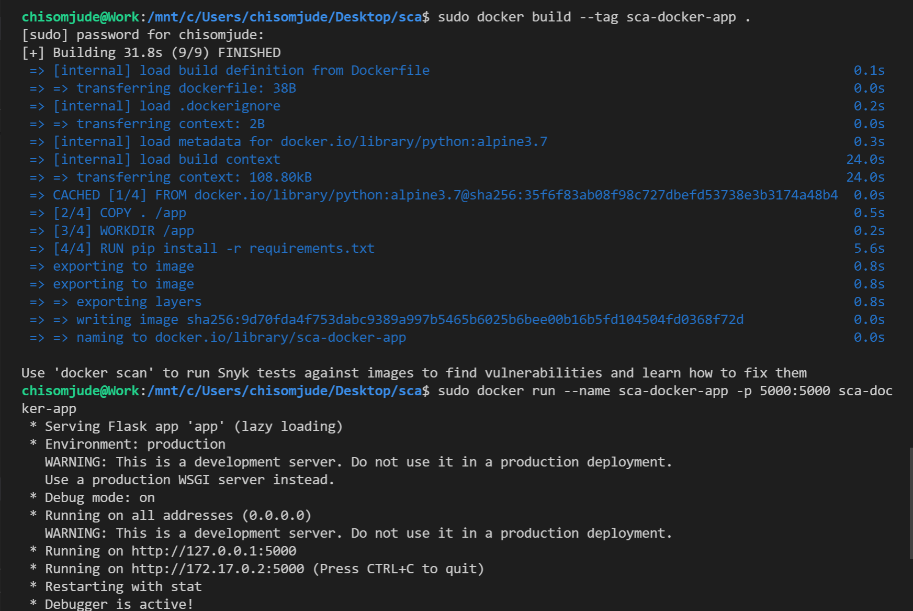

# SCA-Cloud-School-Application


## Steps
Deploy a  simple Flask app, confirm it run using the script below
``` 
    set FLASK_APP=app.py
    run flask
```

### Dockerise the application
> Build the Docker image
> Run the docker image using
```
    sudo docker build --tag sca-docker-app .
    sudo docker run --name sca-docker-app -p 5000:5000 sca-docker-app
```



### View app in Broswer
View Application on Broswer using http://127.0.0.1:5000
